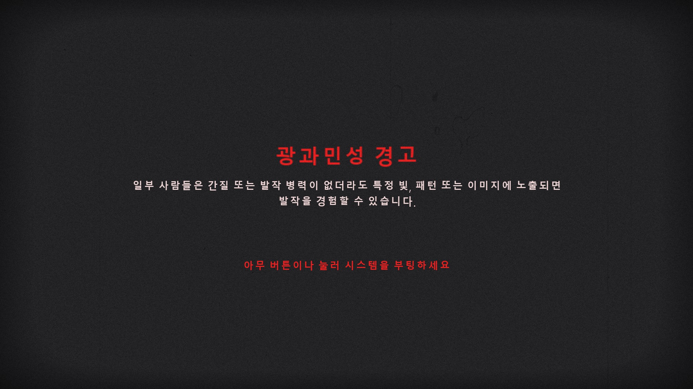
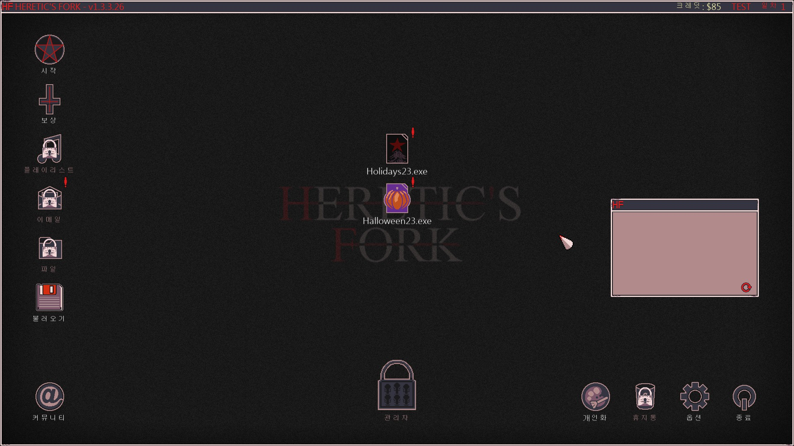
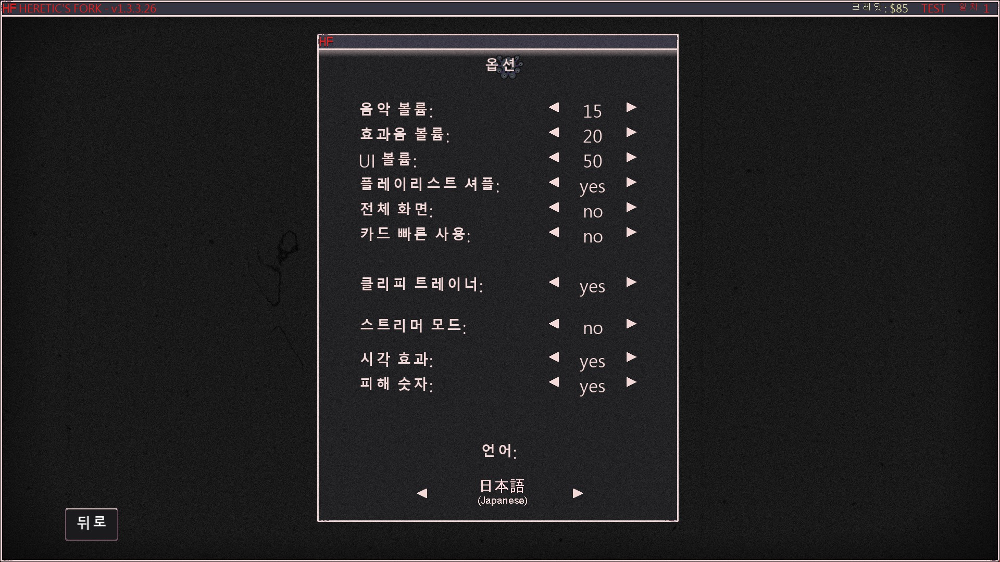
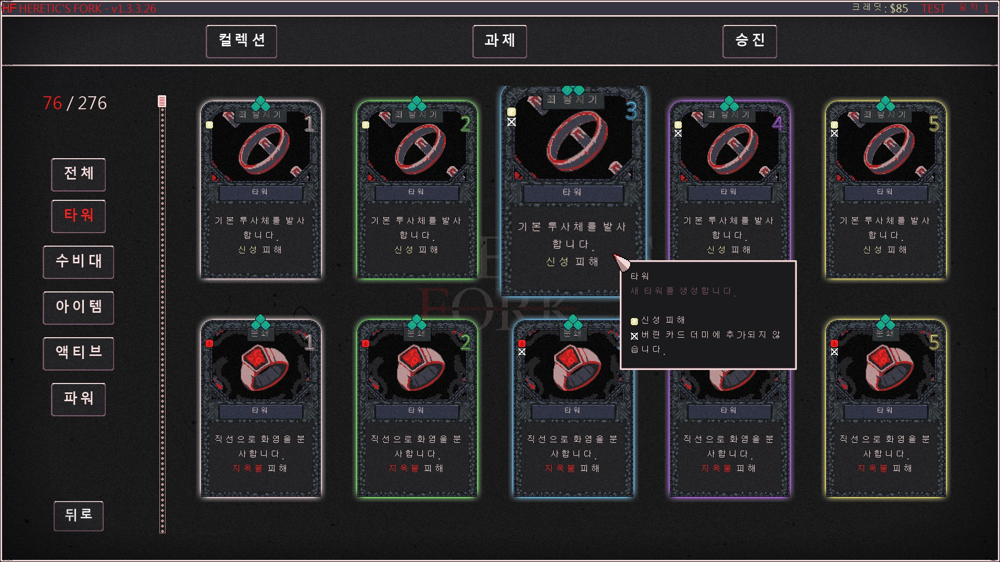
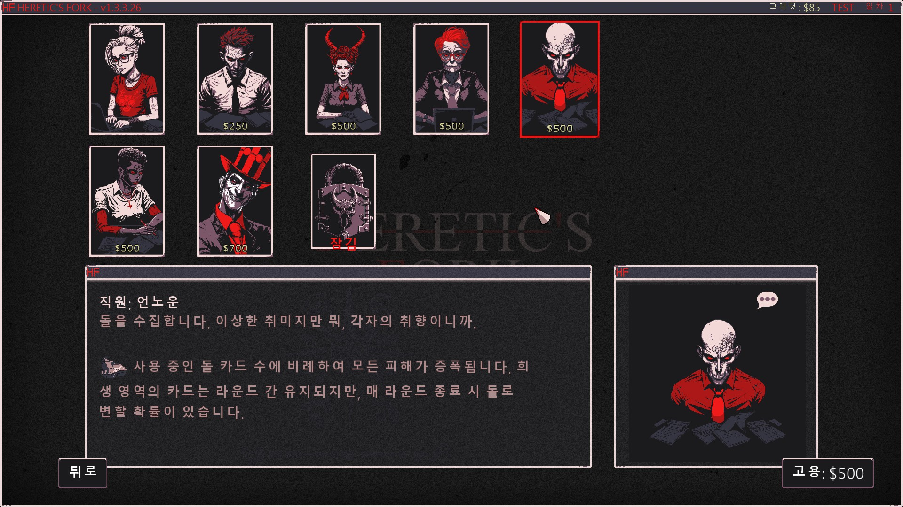
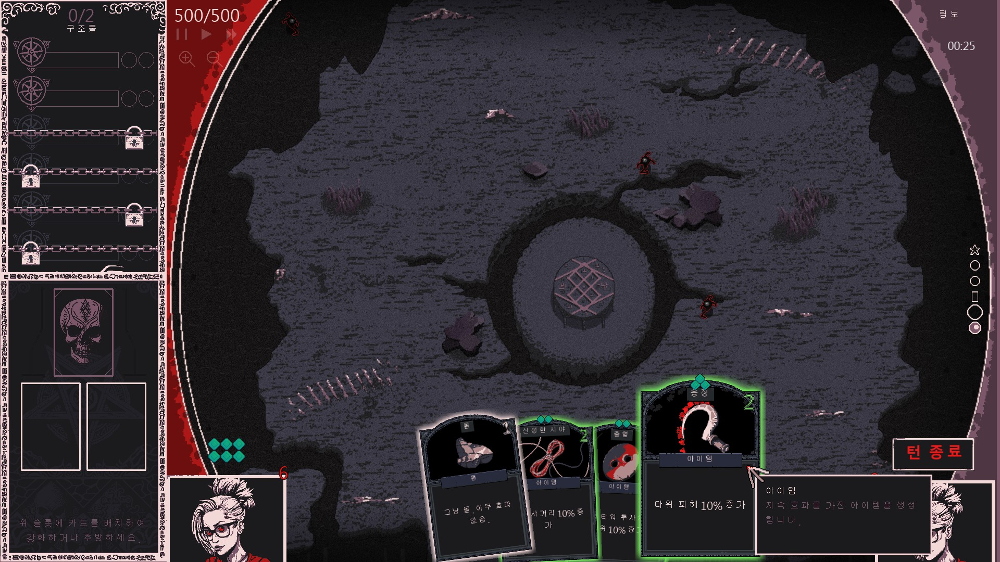

# Heretic's Fork 한글패치 v1.0

> 공식 한국어 지원이 없는 Heretic's Fork의 비공식 한글패치입니다.

---

## 📸 스크린샷

| | |
|---|---|
|  |  |
|  |  |
|  |  |

---

## 📋 번역 범위

| 분류 | 내용 | 상태 |
|------|------|------|
| UI / 메뉴 | 옵션, 메인 메뉴, 플레이리스트, 이메일, 튜토리얼 등 | ✅ 완료 |
| 카드 설명 | 공격/방어/지원 카드 이름, 설명, 사용 텍스트, 증폭 효과 | ✅ 완료 |
| 도전 과제 | 구역별 도전 과제, 잠금 해제 조건, 보상 설명 | ✅ 완료 |
| 캐릭터 대화 | Denny, Fred, Klippy, Gilbert 등 캐릭터 대사 전체 | ✅ 완료 |
| 이메일 / 스토리 | 인게임 이메일, 스토리 텍스트, 엔딩 메시지 | ✅ 완료 |
| DLC 콘텐츠 | 변종(Variant), 추가 캐릭터, DLC 카드 및 도전 과제 | ✅ 완료 |
| **합계** | **1,350개 항목** | ✅ |

---

## 💾 설치 방법

### 필요 조건
- PC (Windows) Steam 버전
- Python 3.10 이상 + Pillow, numpy 라이브러리

### 설치 순서

**1단계 - 다운로드**
아래 Releases에서 `Hanpaemo_HereticksFork-KoreanPatch-v1.0.zip` 다운로드

**2단계 - 압축 해제**
게임 설치 폴더에 **덮어쓰기**로 압축 해제
```
기본 경로: C:\Program Files (x86)\Steam\steamapps\common\Heretic's Fork
```

**3단계 - data.win 패치 실행**
게임 폴더에서 `patch_datawin.py` 실행
```
pip install Pillow numpy
python patch_datawin.py
```
> 원본 `data.win`은 `data.win.bak`으로 자동 백업됩니다.

**4단계 - 게임 실행**
게임을 실행하고 **Options → Language**에서 **"日本語 (Japanese)"** 선택
> ⚠️ 일본어 칼럼을 한국어로 교체한 방식이므로 **일본어를 선택해야** 합니다.

---

## ❓ 자주 묻는 질문

**Q. 왜 일본어를 선택해야 하나요?**

A. 게임에 한국어 언어 옵션이 없으므로, 기존 일본어(JAPANESE) 칼럼을 한국어로 교체하는 방식을 사용합니다. 게임에서 "日本語"를 선택하면 한국어가 표시됩니다.

**Q. data.win 패치를 왜 별도로 실행해야 하나요?**

A. 이 게임은 GameMaker YYC(네이티브 컴파일) 엔진을 사용하며, 폰트가 비트맵 스프라이트로 `data.win`에 내장되어 있습니다. 단순히 TTF 파일만 교체해서는 한글이 표시되지 않고, 내장된 폰트 비트맵 텍스처를 직접 수정해야 합니다.

**Q. Python이 없어요 / 스크립트 실행이 어려워요**

A. 추후 실행 파일(.exe) 형태의 원클릭 설치 프로그램을 제공할 예정입니다. 그 전까지는 [Python 공식 사이트](https://www.python.org/downloads/)에서 설치 후 위 명령어를 실행해주세요.

**Q. Steam 파일 무결성 검사 후 번역이 사라졌어요**

A. 무결성 검사는 패치 파일을 원본으로 복원하므로, 검사 후 패치를 다시 설치하시면 됩니다.

**Q. 게임 업데이트 후 번역이 안 돼요**

A. 게임 업데이트에 따라 패치 재설치가 필요할 수 있습니다. GitHub에서 최신 버전을 확인해주세요.

---

## 🔧 기술 정보

- **번역 방식**: CSV 칼럼 교체 (JAPANESE → Korean) + data.win FONT/TXTR 청크 직접 패치
- **폰트**: Do Hyeon (도현)
- **지원 버전**: Steam PC (Windows)

---

## 📝 오류 제보 / 기여

번역 오류나 누락된 텍스트는 아래로 알려주세요:
- **Issues**: [GitHub Issues](https://github.com/hanpaemo/heretics-fork-korean-patch/issues)
- **블로그**: https://hanpaemo.blogspot.com

---

## ❤️ 후원

번역이 도움이 되셨다면 응원 부탁드립니다!
- **Ko-fi**: https://ko-fi.com/hanpaemo

---

## 👤 제작

**한패모** - 인디게임 한글패치 모음
- GitHub: https://github.com/hanpaemo
- 블로그: https://hanpaemo.blogspot.com

---

## ⚖️ 라이선스

이 패치는 팬 제작 비공식 번역입니다.
게임 원작의 저작권은 **9FingerGames**에 있습니다.
상업적 이용을 금지합니다.
